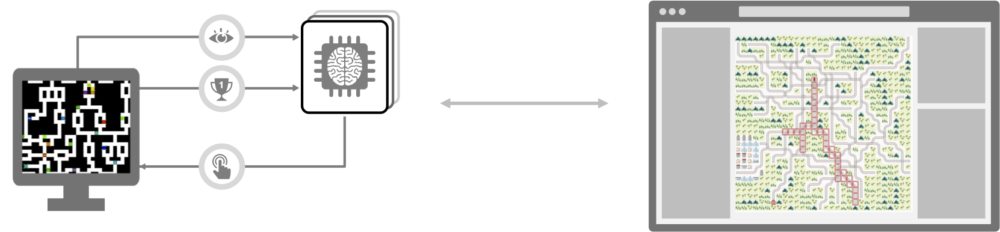

# Flatland HMI



A simple prototype demonstrating how to create a Human-Machine Interface (HMI) that can interact with a Flatland simulation environment. This repository showcases the integration between a web-based frontend and a Python backend running Flatland railway simulations.

## Overview

This project consists of:

- **Frontend**: An Angular application that provides a very basic visual interface for viewing and controlling Flatland simulations
- **Backend**: A FastAPI server that manages the Flatland environment and exposes REST APIs for interaction

The HMI allows users to visualize railway networks, observe train movements, and control the simulation through step-by-step execution or continuous playback.

## Quick Start

### Backend
```bash
cd backend
pip install -r requirements.txt
uvicorn main:app --reload
```

### Frontend
```bash
cd frontend
npm install
npm run start
```

Open your browser and navigate to `http://localhost:4200` to interact with the Flatland simulation.

## Features

- Real-time visualization of railway environments
- Train movement tracking with directional indicators
- Interactive simulation controls (step, play, pause, reset)
- Multiple policy implementations (random, deadlock avoidance)
- RESTful API for environment interaction

## Technologies

- **Frontend**: Angular, TypeScript, SCSS
- **Backend**: FastAPI, Python, Flatland-RL
- **Communication**: HTTP REST APIs with CORS support