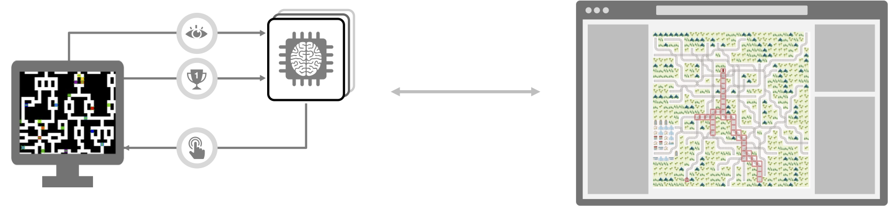

# Flatland HMI



A simple prototype demonstrating how to create a Human-Machine Interface (HMI) that can interact with a Flatland simulation environment. This repository
showcases the integration between a web-based frontend and a Python backend running Flatland railway simulations.

## Overview

This project consists of:

- **Frontend**: An Angular application that provides a very basic visual interface for viewing and controlling Flatland simulations
- **Backend**: A FastAPI server that manages the Flatland environment and exposes REST APIs for interaction

The HMI allows users to visualize railway networks, observe train movements, and control the simulation through step-by-step execution or continuous playback.

## Quick Start

### Backend

Install:

```bash
cd backend
pip install -r requirements.txt
```

Run:

```bash
python -m uvicorn main:app --reload
```

### Frontend

Install:

```bash
cd frontend
npm install
```

Run:

```bash
cd frontend
npm run start
```

Open your browser and navigate to `http://localhost:4200` to interact with the Flatland simulation.

## Quick Start Docker Pre-Built Images from GitHub Container Registry

```bash
docker run -p 8000:8000 ghcr.io/flatland-association/flatland-hmi-backend:latest 
docker run -p 80:80 ghcr.io/flatland-association/flatland-hmi-frontend:latest 
```

## Releases

Releases are automated with [release-please](https://github.com/googleapis/release-please) (`.github/workflows/publish.yml`):

1. Every commit to `main` should follow [Conventional Commits](https://www.conventionalcommits.org/) (`feat:`, `fix:`, `chore:`, ...) — release-please uses these to determine the next version and to generate the changelog.
2. release-please keeps an up-to-date "release PR" open, accumulating changelog entries as commits land on `main`.
3. Merging that PR creates a GitHub Release and a `v*` tag.
4. That tag triggers `docker-publish-frontend`/`docker-publish-backend`, which build and push `ghcr.io/flatland-association/flatland-hmi-frontend` and `ghcr.io/flatland-association/flatland-hmi-backend`, tagged with the release version (e.g. `v1.2.3`). `latest` is owned separately by `.github/workflows/build.yml`, which tracks the tip of `main` on every push.

## Features

- Real-time visualization of railway environments
- Train movement tracking with directional indicators
- Interactive simulation controls (step, play, pause, reset)
- Multiple policy implementations (random, deadlock avoidance)
- RESTful API for environment interaction

## Technologies

- **Frontend**: Angular, TypeScript, SCSS
- **Backend**: FastAPI, Python, Flatland-RL
- **Communication**: HTTP REST APIs with CORS support