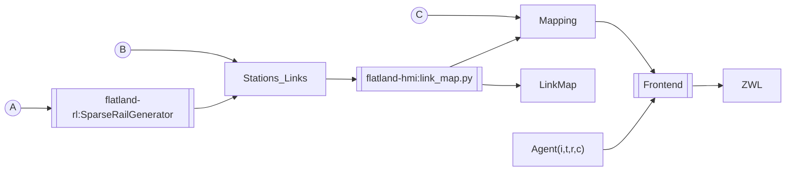

# ZWL

* Public demo (beta): https://hmi-int.flatland.cloud

## Frontend code entry points

- "Map" (pure Flatland grid with agents):  [map](frontend/src/app/map)
- "Link Map" (linearized view on a station to station link): [link-map](frontend/src/app/link-map)
- "ZWL" (time-space diagram): [marey](frontend/src/app/marey)

## Data Pipeline

* A: rail generator for random envs
* B: manually curated stations links to produce link map and mapping with `link_map.py` and opt. manual fine-tuning of link map and mapping
* C: manually curated mapping (without link map)

### Data code entry ppoints and documentation

* [Documentation Stations and Links](https://flatland-association.github.io/flatland-book/environment/environment/stations_links.html)
* [SparseRailGenerator](https://github.com/flatland-association/flatland-rl/pull/441)
* [link_map.py](https://github.com/flatland-association/flatland-hmi/pull/26)

