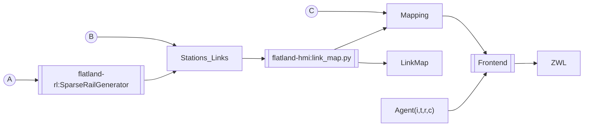

# ZWL

3 entrypoints:

* A: rail generator for random envs
* B: manually curated stations links to produce link map and mapping with `link_map.py` and opt. manual fine-tuning of link map and mapping
* C: manually curated mapping (without link map)

## Links

* [Documentation Stations and Links](https://flatland-association.github.io/flatland-book/environment/environment/stations_links.html)
* [SparseRailGenerator](https://github.com/flatland-association/flatland-rl/pull/441)
* [link_map.py](https://github.com/flatland-association/flatland-hmi/pull/26)

